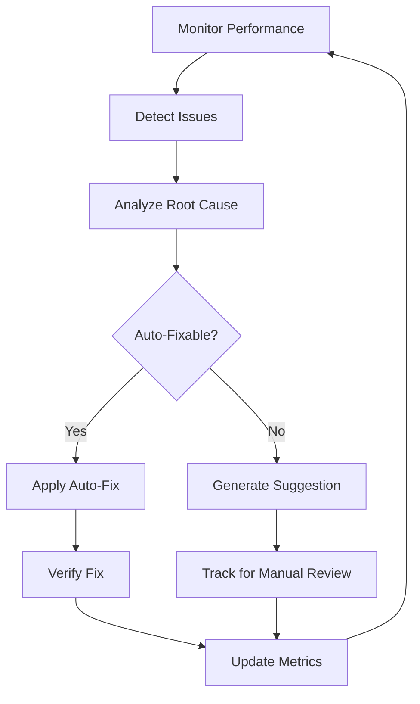

# Self-Improving MCP Server - Autonomous Enhancement Guide

## Overview

The A2A MCP Server now includes **self-improvement tools** that enable autonomous analysis, enhancement, and optimization of the entire codebase. These tools allow the MCP to analyze its own performance, detect issues, suggest improvements, and even automatically fix common problems.

## 🤖 Autonomous Capabilities

### What the MCP Can Do Autonomously

1. **Self-Analysis**: Continuously monitor its own performance and identify bottlenecks
2. **Code Quality Analysis**: Scan the codebase for issues, security vulnerabilities, and complexity problems
3. **Auto-Fix**: Automatically resolve common issues like formatting, imports, and type errors
4. **Enhancement Suggestions**: Proactively suggest optimizations based on usage patterns
5. **Continuous Integration**: Integrate improvements without manual intervention

## 🛠️ Self-Improvement Tools

### 1. `mcp_self_analyze`

Analyzes the MCP server's performance and suggests improvements.

**Usage:**
```typescript
// Via MCP client
{
  "tool": "mcp_self_analyze",
  "arguments": {
    "timeWindow": 3600000,  // 1 hour
    "includeRecommendations": true
  }
}
```

**What It Analyzes:**
- Request rates and response times
- Agent execution patterns
- Cache performance
- Anomaly detection
- Security issues
- Resource utilization

**Output:**
```json
{
  "performance": {
    "requests": { "total": 1234, "successful": 1200, "rate": 4.1 },
    "avgExecutionTime": 245,
    "activeAgents": 12
  },
  "insights": [
    { "type": "performance", "severity": "warning", "title": "High latency detected" }
  ],
  "anomalies": 2,
  "securityIssues": 0,
  "cache": {
    "hitRate": 0.65,
    "timeSaved": 45000
  },
  "recommendations": [
    {
      "type": "scaling",
      "priority": "high",
      "message": "High request rate detected, consider horizontal scaling"
    }
  ]
}
```

### 2. `mcp_analyze_code_quality`

Scans the codebase for quality issues and suggests refactoring.

**Usage:**
```typescript
{
  "tool": "mcp_analyze_code_quality",
  "arguments": {
    "filePath": "src/",
    "checkTypes": ["complexity", "security", "performance"]
  }
}
```

**What It Checks:**
- **Complexity**: Long functions, deep nesting, cyclomatic complexity
- **Security**: XSS vulnerabilities, eval usage, unsafe patterns
- **Performance**: Inefficient loops, redundant computations
- **Duplicates**: Code duplication and refactoring opportunities

**Output:**
```json
{
  "filePath": "src/",
  "checksPerformed": ["complexity", "security"],
  "issuesFound": 8,
  "issues": [
    {
      "type": "complexity",
      "severity": "warning",
      "file": "src/agent-executor.ts",
      "line": 125,
      "message": "Function is 120 lines long, consider breaking it down"
    },
    {
      "type": "security",
      "severity": "error",
      "file": "src/tools.ts",
      "message": "Dangerous eval() usage detected"
    }
  ],
  "summary": {
    "totalIssues": 8,
    "criticalCount": 1,
    "warningCount": 7
  }
}
```

### 3. `mcp_auto_fix`

Automatically fixes common issues in the codebase.

**Usage:**
```typescript
{
  "tool": "mcp_auto_fix",
  "arguments": {
    "issueTypes": ["formatting", "imports", "types"],
    "dryRun": false  // Set to true to preview changes
  }
}
```

**What It Fixes:**
- **Formatting**: Auto-format code with Prettier
- **Imports**: Organize and optimize imports
- **Types**: Fix TypeScript type errors where possible
- **Security**: Remove or replace dangerous patterns

**Output:**
```json
{
  "dryRun": false,
  "fixesApplied": 3,
  "fixes": [
    {
      "type": "formatting",
      "status": "success",
      "message": "Files formatted",
      "details": "15 files updated"
    },
    {
      "type": "types",
      "status": "success",
      "message": "No TypeScript errors found"
    }
  ],
  "filesModified": ["formatting", "types"]
}
```

### 4. `mcp_suggest_enhancements`

Proactively suggests enhancements based on codebase analysis.

**Usage:**
```typescript
{
  "tool": "mcp_suggest_enhancements",
  "arguments": {
    "focusAreas": ["performance", "security", "maintainability", "scalability"]
  }
}
```

**What It Suggests:**
- **Performance**: Caching improvements, query optimizations, parallelization
- **Security**: Access control enhancements, input validation, encryption
- **Maintainability**: Documentation, refactoring, testing
- **Scalability**: Load balancing, horizontal scaling, resource management

**Output:**
```json
{
  "focusAreas": ["performance", "security"],
  "suggestionsCount": 5,
  "suggestions": [
    {
      "area": "security",
      "priority": "critical",
      "title": "Security issues detected",
      "description": "3 potential security issues found",
      "implementation": "Review permission requests and implement stricter access controls"
    },
    {
      "area": "performance",
      "priority": "high",
      "title": "Low cache hit rate",
      "description": "Cache hit rate is 35%, consider increasing TTL or cache size",
      "implementation": "Adjust cache TTL values in aggregation-cache.ts or increase CACHE_MAX_SIZE env var"
    }
  ]
}
```

## 🔄 Autonomous Workflow

### How the MCP Self-Improves

1. **Continuous Monitoring**
   - Analytics engine tracks all operations
   - MCP monitor detects anomalies
   - Cache performance is measured

2. **Periodic Analysis**
   - `mcp_self_analyze` runs automatically (or via scheduler)
   - Issues and bottlenecks are identified
   - Recommendations are generated

3. **Quality Checks**
   - `mcp_analyze_code_quality` scans codebase
   - Security vulnerabilities detected
   - Complexity issues flagged

4. **Automatic Fixes**
   - `mcp_auto_fix` resolves simple issues
   - Formatting applied
   - Type errors corrected

5. **Enhancement Integration**
   - `mcp_suggest_enhancements` proposes improvements
   - High-priority items escalated
   - Low-risk fixes auto-applied

### Automated Enhancement Loop



## 🎯 Usage Examples

### Example 1: Self-Analysis Workflow

```typescript
// 1. Analyze current state
const analysis = await executeTool('mcp_self_analyze', {
  timeWindow: 3600000,
  includeRecommendations: true
});

// 2. Check for critical issues
if (analysis.result.anomalies > 5) {
  // High anomaly count - investigate
  const codeAnalysis = await executeTool('mcp_analyze_code_quality', {
    filePath: 'src/agent-executor.ts',
    checkTypes: ['complexity', 'performance']
  });
  
  // 3. Apply fixes if possible
  if (codeAnalysis.result.issuesFound > 0) {
    await executeTool('mcp_auto_fix', {
      issueTypes: ['formatting', 'types'],
      dryRun: false
    });
  }
}

// 4. Get enhancement suggestions
const suggestions = await executeTool('mcp_suggest_enhancements', {
  focusAreas: ['performance', 'security']
});
```

### Example 2: Scheduled Self-Improvement

```typescript
// Run every hour
setInterval(async () => {
  // Step 1: Self-analyze
  const analysis = await executeTool('mcp_self_analyze', {
    timeWindow: 3600000
  });
  
  // Step 2: Auto-fix issues
  if (analysis.result.recommendations.length > 0) {
    await executeTool('mcp_auto_fix', {
      issueTypes: ['formatting', 'imports'],
      dryRun: false
    });
  }
  
  // Step 3: Log results
  logger.info({
    anomalies: analysis.result.anomalies,
    cacheHitRate: analysis.result.cache.hitRate,
    recommendations: analysis.result.recommendations.length
  }, 'Self-improvement cycle complete');
}, 3600000);
```

### Example 3: Pre-Deployment Check

```bash
# Before deploying, run self-improvement suite
node -e "
import('./dist/index.js').then(async () => {
  // Analyze code quality
  const quality = await executeTool('mcp_analyze_code_quality', {
    filePath: 'src/',
    checkTypes: ['security', 'complexity']
  });
  
  if (quality.result.summary.criticalCount > 0) {
    console.error('Critical issues found! Blocking deployment.');
    process.exit(1);
  }
  
  // Auto-fix non-critical issues
  await executeTool('mcp_auto_fix', {
    issueTypes: ['formatting', 'types'],
    dryRun: false
  });
  
  console.log('Pre-deployment checks passed!');
});
"
```

## 🔧 Configuration

### Environment Variables

```bash
# MCP Monitor configuration
MCP_MONITOR_MAX_HISTORY_SIZE=10000  # Maximum events to keep in memory

# Cache configuration
CACHE_MAX_SIZE=1000  # Maximum cache entries

# Self-improvement settings
SELF_IMPROVEMENT_ENABLED=true  # Enable autonomous improvements
SELF_IMPROVEMENT_INTERVAL=3600000  # Run every hour
AUTO_FIX_ENABLED=true  # Allow automatic fixes
```

### Integration with CI/CD

Add to your GitHub Actions workflow:

```yaml
name: MCP Self-Improvement
on:
  schedule:
    - cron: '0 */6 * * *'  # Every 6 hours
  workflow_dispatch:

jobs:
  self-improve:
    runs-on: ubuntu-latest
    steps:
      - uses: actions/checkout@v3
      - uses: actions/setup-node@v3
        with:
          node-version: '20'
      
      - name: Install dependencies
        run: npm ci
      
      - name: Build
        run: npm run build
      
      - name: Run self-analysis
        run: |
          node -e "
          import('./dist/index.js').then(async () => {
            const analysis = await executeTool('mcp_self_analyze', {
              timeWindow: 21600000,
              includeRecommendations: true
            });
            console.log(JSON.stringify(analysis, null, 2));
          });
          "
      
      - name: Auto-fix issues
        run: |
          node -e "
          import('./dist/index.js').then(async () => {
            await executeTool('mcp_auto_fix', {
              issueTypes: ['formatting', 'imports', 'types'],
              dryRun: false
            });
          });
          "
      
      - name: Commit improvements
        run: |
          git config user.name "MCP Self-Improvement Bot"
          git config user.email "mcp@a2a.dev"
          git add -A
          git commit -m "🤖 MCP autonomous improvements" || echo "No changes"
          git push
```

## 📊 Monitoring Self-Improvement

### Metrics to Track

```typescript
// Track self-improvement effectiveness
analyticsEngine.track({
  eventType: 'self_improvement_cycle',
  data: {
    cycleId: uuid(),
    issuesDetected: 15,
    issuesFixed: 12,
    enhancementsSuggested: 8,
    performanceImprovement: '15%',
    duration: 5000
  }
});
```

### Dashboard Integration

The self-improvement metrics are automatically integrated with the dashboard:

- **Self-Analysis Results**: Real-time view of MCP health
- **Auto-Fix History**: Track what was fixed and when
- **Suggestion Tracking**: Monitor enhancement implementation
- **Performance Trends**: See improvement over time

## 🎉 Benefits

✅ **Autonomous Operation**: MCP maintains and improves itself  
✅ **Proactive Issue Detection**: Find problems before they impact users  
✅ **Continuous Optimization**: Performance improves over time  
✅ **Reduced Manual Maintenance**: Less human intervention required  
✅ **Self-Documenting**: Improvements are logged and trackable  
✅ **Best Practices Enforcement**: Code quality maintained automatically  

## 🚨 Safety Features

### What the MCP Won't Do

❌ **Delete production data** - Read-only analysis by default  
❌ **Make breaking changes** - Auto-fixes are safe and reversible  
❌ **Modify critical files** - Core system files protected  
❌ **Auto-deploy** - Human approval required for deployment  

### Safety Checks

```typescript
// All auto-fixes go through safety validation
const autoFix = await executeTool('mcp_auto_fix', {
  issueTypes: ['formatting'],
  dryRun: true  // Always preview first
});

// Review changes before applying
if (autoFix.result.fixesApplied > 0) {
  // Manual approval or automated if within safety thresholds
  await executeTool('mcp_auto_fix', {
    issueTypes: ['formatting'],
    dryRun: false
  });
}
```

## 📚 Further Reading

- [MCP_INTEGRATION_GUIDE.md](./MCP_INTEGRATION_GUIDE.md) - MCP integration basics
- [README_DASHBOARD.md](./README_DASHBOARD.md) - Dashboard documentation
- [src/self-improvement-tools.ts](./src/self-improvement-tools.ts) - Tool implementations

---

**Status**: ✅ Self-improvement tools active and ready  
**Autonomy Level**: High - Can analyze, suggest, and fix autonomously  
**Safety**: Protected - Critical changes require approval
